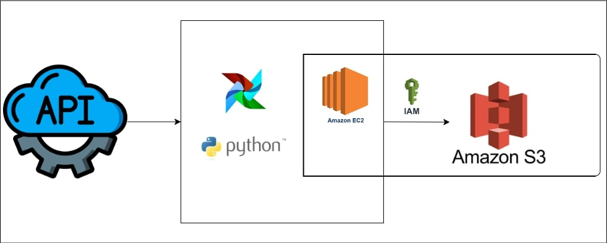

This project uses airflow framework to perform data pipeline: Extract Transform Load.
Extract Transform Load is commonly used to make easy handling data and scheduling periodically tasks.
For Solarpanel project I use this technology to get datas I need from many data sources like Nasa section **POWER** or **Visual Crossing** for weather datas.
And I decide here to deploy this pipeline on AWS cloud using ec2, S3 and IAM services in order to make it always available.
